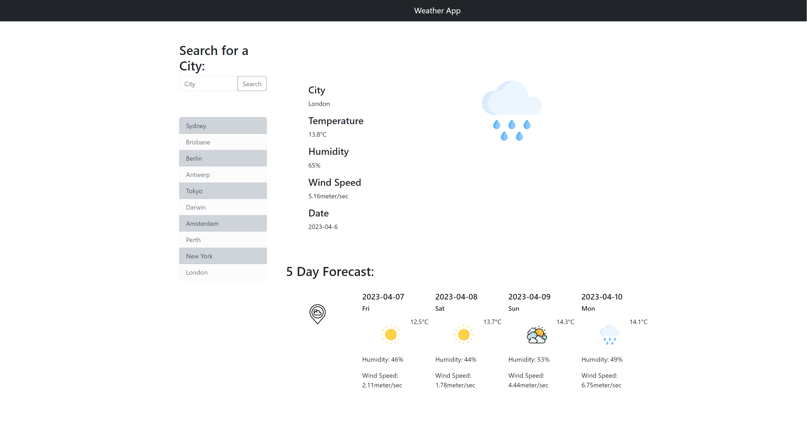

# Weather Dashboard

This project is a weather dashboard that displays current and future weather conditions for multiple cities. The project utilizes the 5 Day Weather Forecast API to retrieve weather data for cities and stores any persistent data using localStorage.

## User Story
- AS A traveler
- I WANT to see the weather outlook for multiple cities
- SO THAT I can plan a trip accordingly

## Acceptance Criteria
- GIVEN a weather dashboard with form inputs
- WHEN I search for a city
- THEN I am presented with current and future conditions for that city and that city is added to the search history
- WHEN I view current weather conditions for that city
- THEN I am presented with the city name, the date, an icon representation of weather conditions, the temperature, the humidity, and the the wind speed
- WHEN I view future weather conditions for that city
- THEN I am presented with a 5-day forecast that displays the date, an icon representation of weather conditions, the temperature, the wind speed, and the humidity
- WHEN I click on a city in the search history
- THEN I am again presented with current and future conditions for that city

## Approach
To approach this project, we started by creating the basic HTML and CSS structure for the weather dashboard. Then we utilized the 5 Day Weather Forecast API to retrieve weather data for cities and dynamically updated the HTML and CSS to display the weather information. We also implemented localStorage to store any persistent data.

## Completed tasks
- Created HTML and CSS structure for the weather dashboard.
- Utilized the 5 Day Weather Forecast API to retrieve weather data for cities.
- Dynamically updated the HTML and CSS to display the weather information.
- Implemented localStorage to store any persistent data.

## Conclusion
In conclusion, the weather dashboard project is a great way for travelers to view current and future weather conditions for multiple cities. The project utilized the 5 Day Weather Forecast API and localStorage to retrieve and store data respectively. Overall, this project was a great opportunity to learn and apply API and localStorage concepts in a real-world scenario.
## Screenshots

## Deployment
The below is a link to the deployed application: 

https://anotnio-lu.github.io/Weather-Dashboard-Server-Side-API/

## Authors

- [Anotnio Lu](https://github.com/Anotnio-Lu)

## License

This project is licensed under MIT License.
